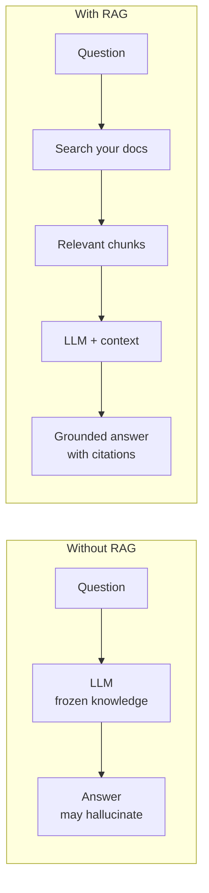
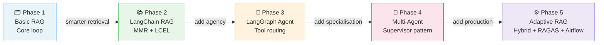
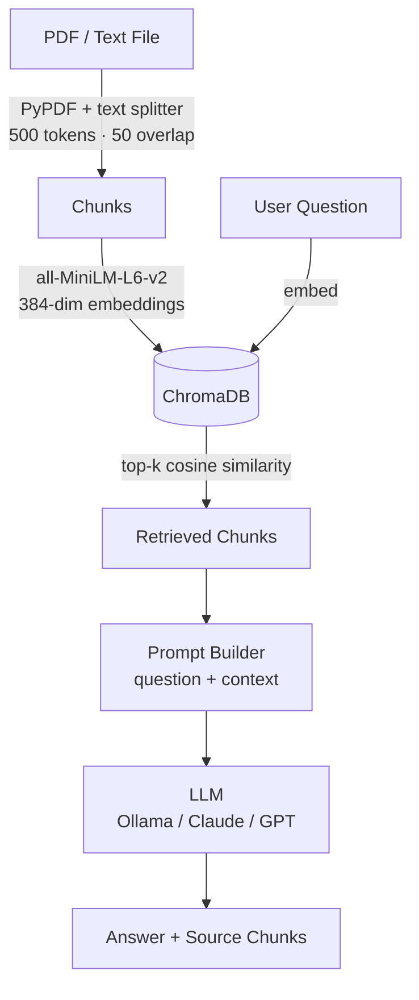
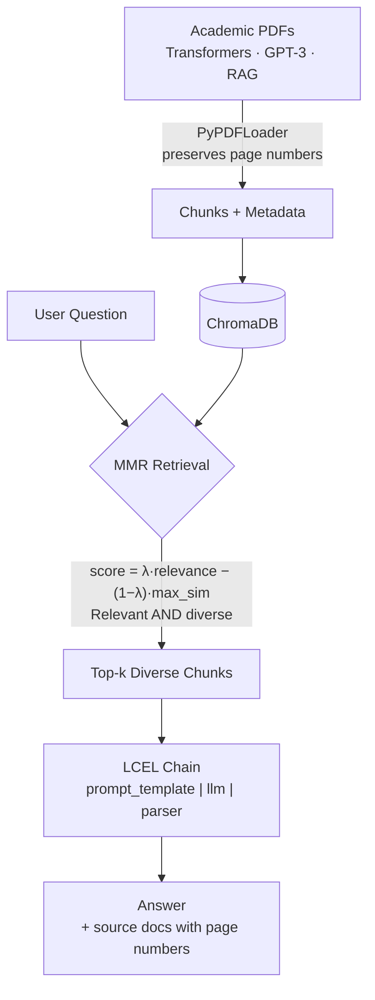
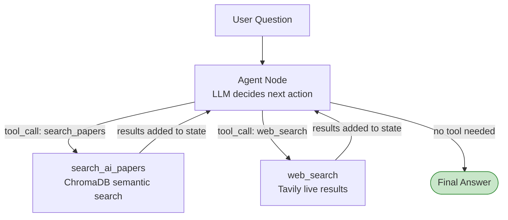
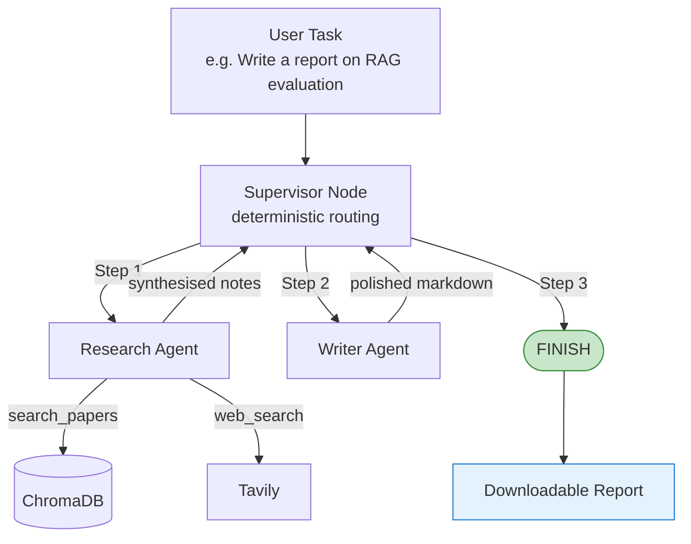
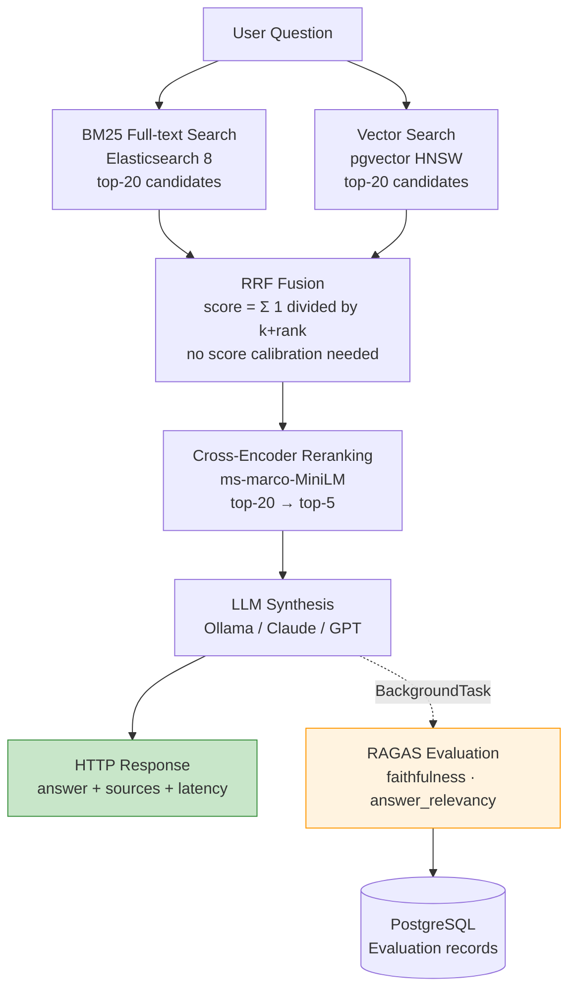
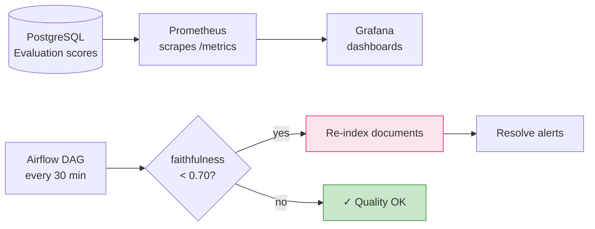
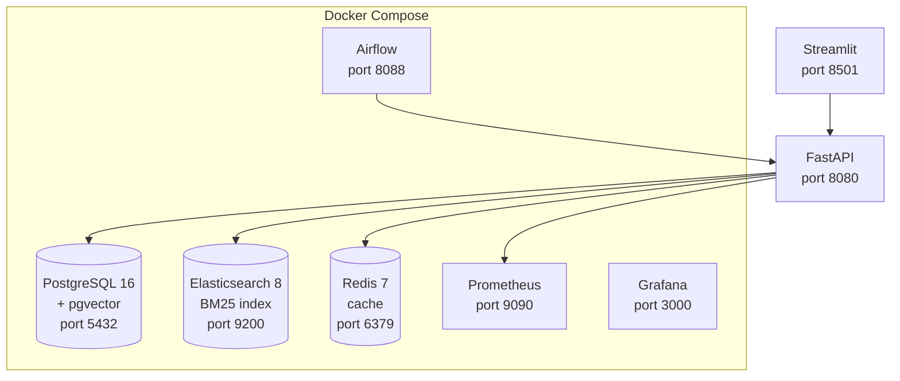

# RAG Systems — GenAI Engineering Portfolio

> A 5-phase hands-on journey: from a 50-line document chatbot to a production RAG system with hybrid retrieval, automated quality evaluation, and self-healing.


**Runs fully offline. No mandatory API keys.**

---

## What is RAG and Why Does It Matter?

Large Language Models know everything up to their training cutoff — and nothing after. Ask GPT-4 about your internal documents, last week's report, or a proprietary dataset: it hallucinates or refuses.

**Retrieval-Augmented Generation (RAG)** fixes this by injecting your own documents into the LLM's context at query time:



The result: accurate, up-to-date, source-cited answers over **your own data** — even content the LLM has never seen. RAG is now the dominant architecture for enterprise AI: legal document analysis, medical knowledge bases, customer support, and internal knowledge management.

---

## Why 5 Phases?

Building a production RAG system means solving many distinct problems. Each phase introduces **exactly one new concept**, keeping the learning incremental and the reasoning traceable.



| Phase | Question it answers | Key addition |
|-------|-------------------|--------------|
| 1 | Can I build a working RAG at all? | ChromaDB · cosine search · LangChain |
| 2 | Can I retrieve smarter, not just more? | MMR retrieval · LCEL · page metadata |
| 3 | Can the system decide what to do? | LangGraph StateGraph · tool routing · web search |
| 4 | Can agents specialise and collaborate? | Supervisor pattern · Research Agent · Writer Agent |
| 5 | Can this run in production with quality guarantees? | Hybrid search · RAGAS · Prometheus · Airflow |

---

## Projects

### Phase 1 — TechDocs Assistant
**[→ View Project](./RAG-Portfolio/phase-1-techdocs-assistant)**

Upload any PDF. Ask questions. Get grounded answers with source chunks.



---

### Phase 2 — LangChain RAG with MMR
**[→ View Project](./RAG-Portfolio/phase-2-langchain-rag)**

Real academic PDFs, page-level citations, and MMR retrieval that avoids redundant context chunks.



> **Why MMR?** Cosine similarity returns the 5 *most similar* chunks — which are often nearly identical paragraphs. MMR returns chunks that are relevant *and* different from each other, making better use of the LLM's context window.

---

### Phase 3 — LangGraph Agentic RAG
**[→ View Project](./RAG-Portfolio/phase-3-langgraph-agent)**

The LLM stops following a fixed pipeline and starts making decisions — which tool to call, when to loop, when to stop.



Every tool call, result, and reasoning step is shown live in the Streamlit UI as the agent thinks.

---

### Phase 4 — Multi-Agent Supervisor System
**[→ View Project](./RAG-Portfolio/phase-4-multi-agent-supervisor)**

Complex tasks need specialisation. A Supervisor routes work between a Research Agent and a Writer Agent, each optimised for its role.



---

### Phase 5 — Adaptive RAG Engine
**[→ View Project](./RAG-Portfolio/phase-5-adaptive-rag-engine)**

Every component gets a production-grade upgrade: hybrid retrieval, automated quality scoring, Prometheus metrics, and an Airflow DAG that re-indexes automatically when quality drops.

#### Retrieval Pipeline



#### Quality Monitoring & Self-Healing



#### Infrastructure



---

## Tech Stack

| Layer | Phase 1 | Phase 2 | Phase 3 | Phase 4 | Phase 5 |
|-------|:-------:|:-------:|:-------:|:-------:|:-------:|
| UI | Streamlit | Streamlit | Streamlit streaming | Streamlit 2-col | FastAPI + Streamlit |
| Vector DB | ChromaDB | ChromaDB | ChromaDB | — | pgvector |
| Full-text | — | — | — | — | Elasticsearch |
| Retrieval | Cosine | MMR | Agent-routed | Agent-routed | BM25 + Vector + RRF |
| Reranking | — | — | — | — | Cross-encoder |
| Orchestration | LangChain | LCEL | LangGraph | LangGraph | FastAPI |
| Agents | — | — | 1 (ReAct) | 3 (Supervisor) | — |
| Evaluation | — | — | — | — | RAGAS |
| Monitoring | — | — | — | — | Prometheus + Grafana |
| Scheduling | — | — | — | — | Airflow DAG |
| Infrastructure | local | local | local | local | Docker Compose |

---

## Key Engineering Decisions

**Why RRF instead of normalising BM25 + cosine scores?**
BM25 and cosine similarity live on different scales. Normalization requires per-query calibration. RRF works on *ranks*, not scores — no calibration needed, robust across any corpus.

**Why async RAGAS evaluation?**
RAGAS calls the LLM again to score answers. With a local model this takes 3–5 minutes. Running it synchronously would make every query 5× slower. Background evaluation keeps user-facing latency at LLM generation time only.

**Why PostgreSQL for vectors instead of a dedicated vector DB?**
pgvector with HNSW indexing lets vector search, metadata filters, and evaluation records live in one transactional store. For production systems, avoiding a second database simplifies ops and consistency.

**Why Airflow for re-indexing instead of a cron job?**
Airflow gives retry logic, task dependency tracking, backfill, and a UI for monitoring DAG runs — all needed when a scheduled task has multiple dependent steps (check quality → ingest → resolve alerts).

---

## Quick Start

```bash
# Phases 1–4 (Streamlit, ~5 min setup)
cd RAG-Portfolio/phase-1-techdocs-assistant  # or phase-2, 3, 4
python -m venv .venv && .venv\Scripts\activate
pip install -r requirements.txt
cp .env.example .env
ollama pull llama3.2          # local LLM — free, no API key
streamlit run app.py          # http://localhost:8501

# Phase 5 (full production stack)
cd RAG-Portfolio/phase-5-adaptive-rag-engine
docker-compose up -d postgres elasticsearch redis prometheus grafana
python -m venv .venv && .venv\Scripts\activate
pip install -r requirements.txt
cp .env.example .env
uvicorn api.main:app --port 8080 --reload
streamlit run dashboard/app.py
# API docs:  http://localhost:8080/docs
# Dashboard: http://localhost:8501
# Grafana:   http://localhost:3000
```
